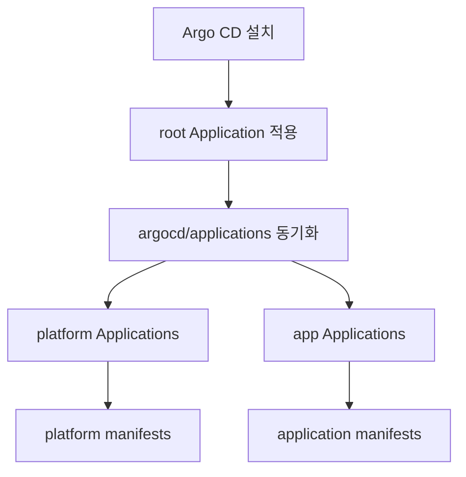

# k3s GitOps 아키텍처

## 목적

이 문서는 k3s 클러스터를 Argo CD와 App of Apps 패턴으로 운영하기 위한
아키텍처 기준서다. 특정 시점의 작업 목록이나 배포 상태를 기록하기보다, 저장소
구조와 설계 의도, 확장 규칙을 설명하는 것을 목표로 한다.

이 저장소는 클러스터의 desired state를 표현하는 진실의 원천이다. 클러스터에
적용되는 플랫폼 구성요소와 애플리케이션 워크로드는 Git에 선언되고, Argo CD가
이를 지속적으로 동기화한다.

## 설계 원칙

- 단일 root `Application`에서 시작한다.
- root `Application`은 하위 Argo CD `Application`만 관리한다.
- 실제 Kubernetes 리소스는 `platform/` 또는 `apps/` 아래에 둔다.
- 플랫폼 구성요소와 비즈니스 애플리케이션은 디렉터리 계층으로 분리한다.
- 의존성 순서는 Argo CD sync wave로 명시한다.
- k3s 기본 Traefik을 ingress 표준으로 사용한다.
- 시점 의존적인 운영 메모는 아키텍처 문서가 아니라 runbook이나 작업 문서에
  둔다.

## 전체 구조

```text
.
├── bootstrap/
│   └── root-app.yaml
├── argocd/
│   ├── applications/
│   │   └── <wave>-<unit-name>.yaml
│   └── projects/
├── platform/
│   └── <component-name>/
├── apps/
│   └── <app-name>/
└── docs/
    └── architecture.md
```

위 구조에서 `argocd/projects/`와 `apps/`는 확장 시 사용하는 표준 위치다.
디렉터리가 비어 있거나 아직 없더라도, 향후 같은 책임을 가진 리소스는 이
구조를 따른다.

## 디렉터리 책임

### `bootstrap/`

클러스터를 GitOps 관리 대상으로 연결하기 위한 최소 bootstrap manifest를 둔다.

`bootstrap/root-app.yaml`은 Argo CD에 수동으로 1회 적용하는 진입점이다. 이
파일은 `argocd/applications/`를 바라보며, 이후 생성되는 하위 application은
Argo CD가 관리한다.

`bootstrap/`에는 다음 성격의 리소스만 둔다.

- root Argo CD `Application`
- 클러스터가 GitOps 루프에 진입하기 위해 필요한 최소 리소스

일반 플랫폼 리소스나 애플리케이션 리소스는 `bootstrap/`에 두지 않는다.

### `argocd/applications/`

Argo CD `Application` custom resource를 둔다.

이 디렉터리는 “무엇을 배포할 것인가”를 선언하는 계층이다. 실제 배포 대상
manifest 전체를 이곳에 넣지 않고, 각 application이 바라볼 `platform/` 또는
`apps/` 하위 경로를 지정한다.

하나의 파일은 하나의 배포 단위를 나타낸다.

```text
argocd/applications/<wave>-<unit-name>.yaml
```

예시:

```text
argocd/applications/00-controller.yaml
argocd/applications/10-controller-resources.yaml
argocd/applications/30-observability.yaml
argocd/applications/40-api.yaml
```

### `argocd/projects/`

Argo CD `AppProject` 리소스를 둘 수 있는 위치다.

초기에는 `default` project만으로도 충분할 수 있다. 다만 다음 조건이 생기면
`AppProject`로 경계를 분리한다.

- 팀별 배포 권한을 분리해야 한다.
- platform과 application의 허용 namespace를 다르게 제한해야 한다.
- 배포 가능한 repository나 cluster destination을 제한해야 한다.
- 환경별 정책을 독립적으로 관리해야 한다.

project manifest도 GitOps로 관리하되, project 자체를 관리하는 application은
권한 경계가 순환되지 않도록 별도 sync wave를 둔다.

### `platform/`

클러스터 공통 인프라 리소스를 둔다.

`platform/`은 여러 애플리케이션이 공유하거나, 애플리케이션 배포 전에 준비되어야
하는 기반 구성요소를 관리하는 계층이다.

예시 범주:

- certificate management
- ingress access layer
- secret integration
- observability
- logging
- policy
- shared namespace 또는 service account
- Argo CD self-management

각 platform component는 일반적으로 하나의 Argo CD `Application`과 대응한다.

```text
argocd/applications/30-<component>.yaml
platform/<component>/
```

### `apps/`

비즈니스 애플리케이션 워크로드를 둔다.

`apps/` 아래의 각 디렉터리는 하나의 독립 배포 단위를 나타낸다. 이 단위는
서비스, API, worker, frontend 등 런타임 소유권이 분명한 애플리케이션을 기준으로
나눈다.

권장 형태:

```text
apps/
  <app-name>/
    namespace.yaml
    deployment.yaml
    service.yaml
    ingress.yaml
```

애플리케이션이 커지면 내부를 다음처럼 나눌 수 있다.

```text
apps/
  <app-name>/
    base/
    overlays/
      dev/
      prod/
```

단일 클러스터와 단일 환경만 운영하는 동안에는 불필요한 overlay를 만들지 않는다.
환경 분리가 실제로 필요해질 때 구조를 확장한다.

## App of Apps 모델

이 저장소는 App of Apps 패턴을 사용한다.

```text
root Application
  ├── platform component Application
  ├── platform dependency Application
  └── business application Application
```

상위 application은 Kubernetes 리소스를 직접 많이 소유하지 않는다. 대신 하위
`Application` 객체를 만들고, 각 하위 application이 자신의 manifest 경로를
소유한다.

이 모델의 의도는 다음과 같다.

- Argo CD UI에서 구성요소별 상태를 독립적으로 확인한다.
- 플랫폼 구성요소의 장애와 애플리케이션 장애를 분리해 본다.
- 작은 manifest 경로 단위로 sync, prune, rollback 범위를 제한한다.
- 배포 순서와 의존성을 application 단위로 표현한다.

## Bootstrap 모델

Bootstrap은 수동 단계와 GitOps 단계의 경계를 정의한다.



수동 단계는 가능한 작아야 한다. Argo CD 설치와 root application 적용 이후의
구성은 Git에 선언하고 Argo CD가 관리한다.

## Sync Wave 규칙

Argo CD sync wave는 배포 단위 간 의존성을 표현한다.

파일명 prefix와 annotation 값을 맞춘다.

```text
argocd/applications/10-example.yaml
```

```yaml
metadata:
  annotations:
    argocd.argoproj.io/sync-wave: "10"
```

annotation이 실제 동작 기준이다. 파일명 prefix는 리뷰와 탐색을 돕는 문서화
장치다.

권장 wave 범위:

| Wave | 용도 |
| --- | --- |
| `00` | CRD, controller, storage class처럼 다른 리소스의 전제가 되는 기반 구성 |
| `10` | 기반 controller가 제공하는 custom resource 또는 cluster-wide 설정 |
| `20` | ingress, certificate, access layer처럼 외부 접근과 연결되는 구성 |
| `30` | observability, logging, policy 같은 운영 플랫폼 |
| `40` | 비즈니스 애플리케이션 워크로드 |
| `90` | 정리성 job, migration hook처럼 가장 뒤에 와야 하는 보조 구성 |

모든 구성요소가 정확히 이 wave를 써야 하는 것은 아니다. 중요한 것은 의존성이
명확히 드러나고, 같은 계층의 리소스가 같은 규칙을 따른다는 점이다.

## Application Manifest 표준 템플릿

모든 child `Application`은 `argocd/applications/` 아래에 둔다. 파일명 prefix와
`sync-wave` annotation은 같은 값을 사용한다.

### Git 경로 기반

`platform/` 또는 `apps/` 아래의 manifest 디렉터리를 바라볼 때 사용한다.

```yaml
apiVersion: argoproj.io/v1alpha1
kind: Application
metadata:
  name: <unit-name>
  namespace: argocd
  annotations:
    argocd.argoproj.io/sync-wave: "<wave>"
spec:
  project: default

  source:
    repoURL: <gitops-repo-url>
    targetRevision: main
    path: <manifest-path>

  destination:
    server: https://kubernetes.default.svc
    namespace: <target-namespace>

  syncPolicy:
    automated:
      prune: true
      selfHeal: true
    syncOptions:
      - ServerSideApply=true
```

### Helm Chart 기반

chart만으로 배포 단위가 충분히 표현될 때 사용한다.

```yaml
apiVersion: argoproj.io/v1alpha1
kind: Application
metadata:
  name: <unit-name>
  namespace: argocd
  annotations:
    argocd.argoproj.io/sync-wave: "<wave>"
spec:
  project: default

  source:
    repoURL: <helm-repository-url>
    chart: <chart-name>
    targetRevision: <chart-version>
    helm:
      releaseName: <release-name>
      valuesObject: {}

  destination:
    server: https://kubernetes.default.svc
    namespace: <target-namespace>

  syncPolicy:
    automated:
      prune: true
      selfHeal: true
    syncOptions:
      - CreateNamespace=true
      - ServerSideApply=true
```

필드 작성 기준:

- `metadata.name`은 파일명에서 wave prefix를 제외한 이름과 맞춘다.
- `metadata.namespace`는 `argocd`를 사용한다.
- `spec.project`는 기본적으로 `default`를 사용하고, 권한 경계가 필요할 때
  `AppProject`로 분리한다.
- `source.path`는 개별 파일보다 배포 단위 디렉터리를 가리킨다.
- `CreateNamespace=true`는 namespace를 Argo CD가 생성해도 되는 배포 단위에만
  사용한다.
- `SkipDryRunOnMissingResource=true`는 CRD discovery 타이밍 문제가 있는
  리소스에만 사용한다.

## CRD와 Custom Resource 배치

CRD를 제공하는 controller와 그 CRD를 사용하는 custom resource는 서로 다른
application으로 분리한다.

예시:

```text
argocd/applications/00-controller.yaml
argocd/applications/10-controller-resources.yaml

platform/controller-resources/
```

이 분리는 다음 이유로 필요하다.

- controller 설치 실패와 custom resource 적용 실패를 분리해 볼 수 있다.
- CRD discovery 타이밍 문제를 sync wave와 sync option으로 완화할 수 있다.
- controller upgrade와 리소스 변경의 blast radius를 줄일 수 있다.

CRD가 아직 discovery되지 않은 시점에 dry-run이 실패할 수 있는 리소스에는
필요한 경우 다음 option을 사용한다.

```yaml
syncOptions:
  - SkipDryRunOnMissingResource=true
```

## Ingress와 인증서 전략

k3s 기본 Traefik을 ingress controller로 사용한다.

Ingress manifest는 다음 기준을 따른다.

```yaml
spec:
  ingressClassName: traefik
```

TLS 인증서는 cert-manager를 통해 발급한다. Ingress 리소스는 사용할
`ClusterIssuer`를 annotation으로 명시한다.

```yaml
metadata:
  annotations:
    cert-manager.io/cluster-issuer: <issuer-name>
```

HTTP-01 검증을 사용하는 issuer는 Traefik ingress class를 사용한다.

```yaml
solvers:
  - http01:
      ingress:
        ingressClassName: traefik
```

backend service가 HTTPS만 제공하는 경우 Traefik에 backend scheme을 명시한다.

```yaml
metadata:
  annotations:
    traefik.ingress.kubernetes.io/service.serversscheme: https
```

## Platform Component 작성 규칙

platform component를 추가할 때는 다음 구조를 사용한다.

```text
argocd/applications/<wave>-<component>.yaml
platform/<component>/
```

`argocd/applications/<wave>-<component>.yaml`은 다음 책임만 가진다.

- source repository
- target revision
- manifest path 또는 Helm chart
- destination namespace
- sync policy
- sync option
- sync wave

`platform/<component>/`는 실제 Kubernetes 리소스를 가진다.

component가 Helm chart로만 충분히 표현되면 별도 `platform/<component>/` 없이
application에서 chart source를 직접 참조할 수 있다. 다만 chart 외에 별도
custom resource, ingress, policy, secret reference가 필요해지는 순간 별도
platform 디렉터리로 분리한다.

## Application 작성 규칙

비즈니스 애플리케이션은 platform 계층에 직접 의존하지 않고, Kubernetes의
표준 인터페이스를 통해 의존한다.

예시:

- 인증서가 필요하면 `ClusterIssuer` 이름을 Ingress annotation으로 참조한다.
- 외부 노출이 필요하면 `ingressClassName: traefik`을 사용한다.
- secret이 필요하면 합의된 secret provider 또는 Kubernetes secret 참조를
  사용한다.

애플리케이션별 Argo CD application은 다음 구조를 따른다.

```text
argocd/applications/40-<app-name>.yaml
apps/<app-name>/
```

애플리케이션 manifest에는 자신이 소유하는 리소스만 둔다. 공통 controller,
cluster-wide issuer, shared policy처럼 여러 앱이 공유하는 리소스는
`platform/`에 둔다.

## 환경과 클러스터 확장

단일 k3s 클러스터에서는 이 문서의 단순 구조를 유지한다.

환경 또는 클러스터가 늘어나면 다음 둘 중 하나로 확장한다.

### 환경별 overlay

같은 클러스터 안에서 dev/prod 같은 환경 차이만 필요한 경우:

```text
apps/
  <app-name>/
    base/
    overlays/
      dev/
      prod/
```

### 클러스터별 루트

서로 다른 클러스터를 별도 desired state로 관리해야 하는 경우:

```text
clusters/
  <cluster-name>/
    applications/
```

이 구조로 확장할 때는 `bootstrap/root-app.yaml`이 바라보는 path를 클러스터별
application 경로로 바꾼다.

초기에는 멀티 환경 구조를 선반영하지 않는다. 실제 운영 경계가 생길 때 확장해
불필요한 계층을 피한다.

## 권한과 보안 경계

root application은 하위 application을 생성할 수 있으므로 저장소 write 권한은
곧 클러스터 변경 권한으로 간주한다.

보안 경계가 필요한 경우 다음 순서로 강화한다.

1. repository write 권한을 운영자 중심으로 제한한다.
2. Argo CD `AppProject`로 source repository, destination namespace, cluster
   resource 허용 범위를 제한한다.
3. platform application과 app application을 서로 다른 project로 분리한다.
4. secret은 Git에 평문으로 저장하지 않고 secret backend 또는 암호화된 manifest
   전략을 사용한다.

## 문서화 규칙

이 문서는 장기적인 설계 의도와 구조 규칙만 담는다.

다음 내용은 이 문서에 넣지 않는다.

- 특정 날짜의 작업 목록
- 임시 placeholder 변경 안내
- 일회성 배포 절차
- 현재 클러스터 상태 캡처
- 특정 애플리케이션의 릴리스 메모

이런 정보는 별도 runbook, 운영 기록, PR 설명, issue, 또는 작업 문서에 둔다.

## 참고 문서

- Argo CD cluster bootstrapping:
  https://argo-cd.readthedocs.io/en/stable/operator-manual/cluster-bootstrapping/
- Argo CD sync phases and waves:
  https://argo-cd.readthedocs.io/en/stable/user-guide/sync-waves/
- cert-manager Helm installation:
  https://cert-manager.io/docs/installation/helm/
- Traefik Kubernetes Ingress routing:
  https://doc.traefik.io/traefik/reference/routing-configuration/kubernetes/ingress/
